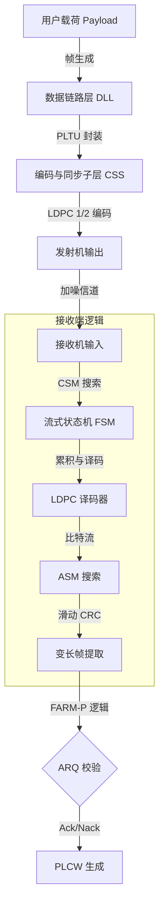

# Proximity-1 Space Link Protocol & Physical Layer Simulation


## 1. 项目概述 (Project Overview)

本项目基于 MATLAB 平台，设计并实现了一个高保真的 **CCSDS Proximity-1 (邻近-1)** 空间链路协议仿真系统。项目包含两个核心子系统：

1. **协议栈仿真 (`datalink/`)**：聚焦于 **数据链路层 (DLL)** 和 **编码与同步子层 (CSS)**。实现了从 ARQ 自动重传、帧封装到 LDPC 信道编码的完整闭环，具备流式处理（Streaming）和状态机（FSM）接收能力。
2. **物理层信号仿真 (`physical/`)**：基于 **LISA (Laser Interferometer Space Antenna)** 场景的光通信物理层仿真。实现了激光干涉、光电检测、PLL 锁相环以及基于 DLL (Delay Locked Loop) 的高精度测距与解调。

本项目旨在验证深空通信环境下的协议鲁棒性、同步机制的稳定性以及物理层测距通信一体化的性能。

---

## 2. 符合标准 (Standards Compliance)

本系统的设计严格遵循以下国际及国家标准：

* **CCSDS 211.0-B-6**: Proximity-1 Space Link Protocol - Data Link Layer.
* **CCSDS 131.0-B-5**: TM Synchronization and Channel Coding (C2 LDPC).
* **GB/T 39353-2020**: 空间数据与信息传输系统 邻近-1 空间链路协议 (修改采用 ISO 21459:2015).

---

## 3. 系统架构与关键特性 (Architecture & Features)

### 3.1 协议栈子系统 (`datalink/`)

`datalink` 子系统模拟了从用户载荷数据到物理层符号流的转换，采用了流式处理架构。



* **COP-P 通信操作过程**:
  * **FOP-P (发送端)**: 维护 $V(S)$ 状态，支持 **Go-Back-N** 自动重传策略，管理发送队列。
  * **FARM-P (接收端)**: 维护 $V(R)$ 状态，实现帧过滤、乱序检测 (Gap Detection) 和重复帧丢弃，生成 PLCW 控制字。
* **编码与同步 (CSS)**:
  * **LDPC 编码**: 实现 CCSDS C2 码族 (Rate 1/2, $k=1024, n=2048$)，包含矩阵生成、打孔 (Puncturing) 和伪随机化 (Randomization)。
  * **双重同步机制**: 物理层使用 **CSM (64-bit)** 进行码块同步，链路层使用 **ASM (24-bit)** 进行帧定界。
* **流式接收机 (Streaming Receiver)**:
  * 基于 **双缓冲分层状态机 (Dual-Buffer Hierarchical FSM)** 架构。
  * 支持碎片化 (Fragmented) 数据输入，模拟真实的硬件/SDR FIFO 行为。
  * 实现 **滑动 CRC (Sliding CRC)** 算法，在未知帧长情况下自适应提取变长帧。

### 3.2 物理层子系统 (`physical/`)

该部分模拟了基于伪码调制的激光测距与通信链路。


* **信号链路**: 伪码扩频 (DSSS) $\to$ 激光相位调制 $\to$ 光电混合 (PD) $\to$ 信号解调。
* **核心算法**:
  * **PLL (锁相环)**: 实现 Costas 环/科斯塔斯环逻辑，完成载波同步与相位提取。
  * **DLL (延迟锁相环)**: 实现超前-滞后 (Early-Late) 门相关器，完成伪码同步与高精度飞行时间 (ToF) 测距。
* **性能**: 支持在低信噪比下同时输出误码率 (BER) 和测距误差。

---

## 4. 目录结构 (Directory Structure)

```textile
Protocol-for-TQ/
├── datalink/                   # [子系统1] 协议栈仿真
│   ├── archive/                # 历史测试脚本
│   ├── data/                   # LDPC H矩阵(.mat)
│   ├── libs/                   # 核心算法库 (FOP, FARM, LDPC, CRC, FSM)
│   │   ├── Proximity1Receiver.m  # 流式状态机接收机
│   │   ├── scs_transmitter.m     # 发送主控
│   │   └── ...                   # 等...
│   ├── readme/                 # 技术文档 (Markdown)
│   ├── utils/                  # 工具 (如 LDPC 矩阵生成)
│   ├── test_main.m             # [入口] 全协议栈闭环仿真脚本
│   ├── test_unit_fsm.m         # 接收机状态机单元测试
│   └── test_unit_farm.m        # FARM 逻辑单元测试
├── physical/                   # [子系统2] 物理层信号仿真
│   ├── data/                   # 伪码数据 (.mat)
│   ├── libs/                   # 物理层算法 (PLL, DLL, PD)
│   ├── multi_group_test.m      # [入口] 多组数据通信测距仿真
│   └── single_test.m           # 单组数据调试脚本
├── readme.MD                   # 本文件
└── LICENSE                     # MIT License
```

---

## 5. 快速开始 (Quick Start)

### 5.1 环境要求

- MATLAB R2024b 或更高版本。

- 必需工具箱: **Communications Toolbox** (用于 CRC 检测器和 LDPC 系统对象)。

### 5.2 初始化

在首次运行协议栈仿真前，必须生成 LDPC 校验矩阵：

Matlab

```
% 在 MATLAB 命令行中运行
cd datalink/utils
generate_LDPC_matrix
```

此操作将在 `data/` 目录下生成 `CCSDS_C2_matrix.mat`，供编码器和译码器加载。

---

## 6. 使用指南 (Usage)

### 6.1 运行协议栈全闭环仿真 (Protocol Stack)

该仿真演示了 Alice (发送) 和 Bob (接收) 之间的通信，包含信道丢包和 ARQ 重传。

1. 打开 `datalink/test_main.m`。

2. 运行脚本。

3. **预期输出**:
   
   - 控制台将打印发送序列号、信道状态（模拟 SNR 骤降）、接收端 FARM 状态及 PLCW 反馈。
   
   - 能够观察到 **NACK** 的产生以及随后的 **Go-Back-N 重传** 过程。

### 6.2 运行物理层测距通信仿真 (Physical Layer)

该仿真演示了激光链路的信号处理流程。

1. 打开 `physical/multi_group_test.m`。

2. 运行脚本。

3. **预期输出**:
   
   - 输出综合误码率 (BER) 和平均测距误差。
   
   - 生成图表显示每一组数据的误码率和测距精度。
   
   - 结果保存在 `physical/results/` 目录下。

---

## 7. 核心算法细节 (Technical Details)

### 7.1 CRC-32 校验

- **多项式**: `0x00A00805` ($x^{32} + x^{23} + x^{21} + x^{11} + x^2 + 1$)。

- **配置**: 初始值全 0，结果不取反，MSB 优先。不同于以太网 CRC。

### 7.2 LDPC 编码 (CCSDS C2)

- **构造**: 准循环 (QC-LDPC)，基于 $512 \times 512$ 子矩阵构造 $1536 \times 2560$ 校验矩阵 $H$。

- **流程**: 信息位(1024) $\to$ 编码(2560) $\to$ 打孔(末尾512位) $\to$ 随机化 $\to$ 插入 CSM(64位)。

- **译码**: BP (Belief Propagation) 算法，支持软信息 (LLR) 输入。

### 7.3 接收机状态机 (FSM)

`Proximity1Receiver` 类维护了两个主要状态：

1. **SEARCH_CSM**: 使用滑动相关器在噪声中寻找 CSM 同步头。

2. **ACCUMULATE_BLOCK**: 锁定后累积 2048 bits 数据用于 LDPC 译码。
- 译码后的比特流进入二级缓冲区，通过搜索 ASM (`0xFAF320`) 和滑动 CRC 窗口提取变长帧。

### 7.4 物理层 PLL & DLL

- **光电检测 (PD)**: $I \propto |E_{LO} + E_{Sig}|^2$，提取混频分量。

- **PLL**: 跟踪载波相位，消除多普勒频移影响。

- **DLL**: 采用 "Early-Minus-Late" 功率鉴别器，对齐本地伪码与接收伪码，实现亚码片级的测距精度。

---

## 8. 作者与许可证 (Author & License)

- **Author**: Yin Xinyu

- **Copyright**: © 2025 Yin Xinyu

- **License**: MIT License. See the [LICENSE](https://www.google.com/search?q=./LICENSE) file for details.

---

> **Note**: 本项目为仿真原型，代码中禁用了部分安全检查以方便调试。在实际部署或参考时，请注意处理敏感信息保护。
